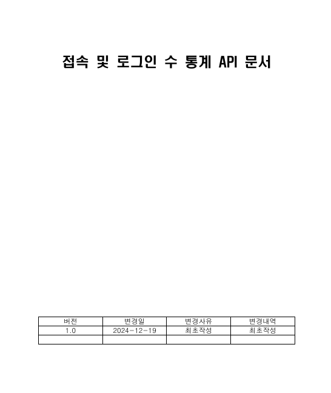
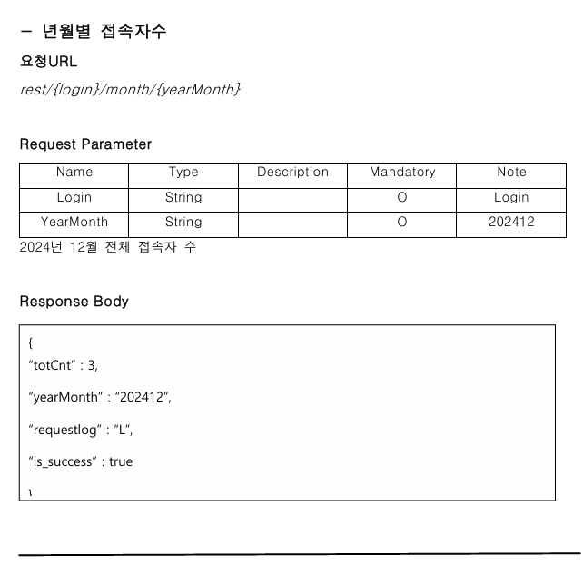
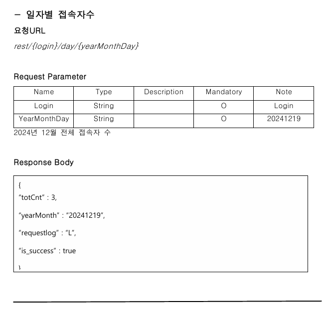
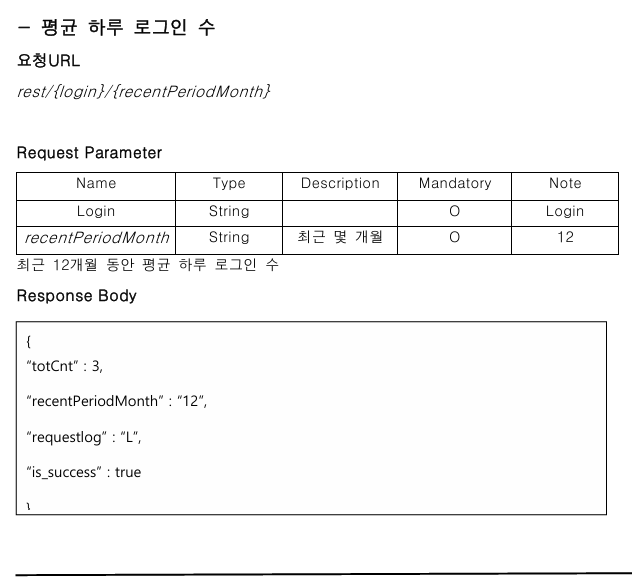
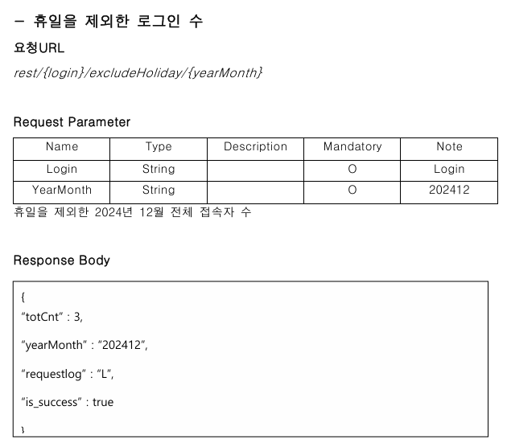
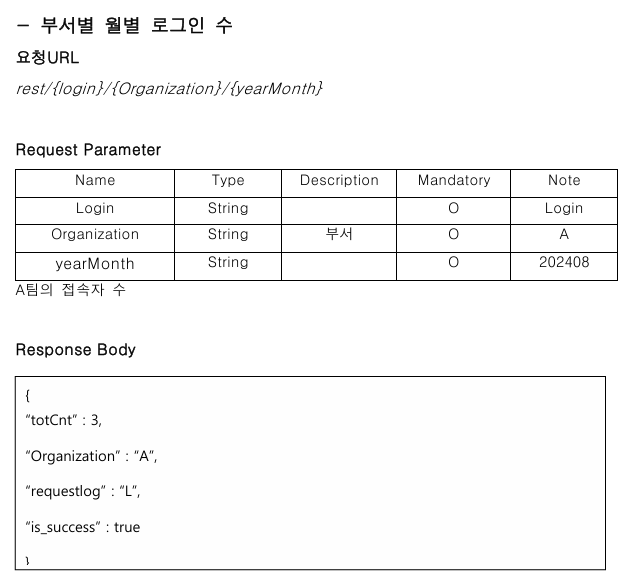

## 코멘토 springboot, mariaDB로 접속자 수, 로그인 수 통계 API 구축하기

### 1차 과제
1. spring 개발환경 셋팅

   ○ IntelliJ Community 버전 설치 ( 2024.01 )
        
        - JDK 11버전, maven, jetty(톰캣x)

   ○디비버 커뮤니티 버전 다운로드

        - mariaDB 커넥션 진행

### 2차 과제

1. 학습

   ○ REST

         - HTTP URI를 통해 자원(Resource)을 명시하고,
           HTTP Method(POST, GET, PUT, DELETE, PATCH 등)를 통해
           해당 자원(URI)에 대한 CRUD Operation을 적용하는 것

         - REST 구성 요소 : 
               자원(HTTP URI), 자원에 대한 행위(HTTP Method), 자원에 대한 행위의 
               내용(HTTP Message Pay Load)

   ○ REST API

         - REST의 원리를 따르는 API를 의미한다.

   ○ RESTful

         - REST의 원리를 따르는 시스템을 의미한다.
         - REST API의 설계 규칙을 올바르게 지킨 시스템을 RESTful하다 말할 수 있으며 
            올바르게 지키지 못한 시스템은 REST API를 사용하였지만 RESTful하지 못한 시스템이라고 말할 수 있다.

   ○ HTTP 통신

         - 클라이언트가 서버에 요청 메시지를 보내고 서버는 클라이언트의 요청에 대한 응답을 반환한다. 
            연결 상태를 유지하지 않는 비연결성 프로토콜이며, 요청과 응답(request, response)방식으로 동작한다.
         - HTTP Request 구조는 Request Line, Header, Body로 이루어져 있고
            HTTP Response의 구조는 Status Line, Header Lines, Body로 이루어져 있다.

   ○ 브라우저에 URL을 입력 후 요청하여 서버에서 응답하는 과정까지에 대해 학습한 내용을 작성

         - 사용자가 웹 브라우저를 통해 URL을 입력하여 웹 페이지를 요청하면, 
            브라우저(클라이언트)는 해당 요청을 서버에 전송하고, 서버는 요청받은 웹 페이지를 클라이언트에게 전송한다.

2. API 문서 작성

### 3차 과제

1. 간단한 Restful API 구현

   ○  Springboot, Rest Controller를 이용하여 백엔드를 이해

        - 진행하면서 sql쿼리가 실행되지 않아서 "is_success"의 값이 false로 나왔다. 무슨 문제인지 찾아봤더니
         sql쿼리가 정의되어 있는 mapper.xml가 main/resources/.. 경로에 있지 않아서 생긴 문제였고 경로를 수정했더니 성공적으로 sql쿼리의 결과가 출력되었다.
         mapper파일을 main/resources/.. 이 아닌 다른 경로로 바꾸고 싶다면 application.properties에 mybatis.mapper-locations= mybatis-mapper/*.xml 이런 식으로 작성하여 변경할 수 있다.

2. SW 활용 현황 통계 API 구축을 위한 SQL 작성

   ○  1) 월별 접속자 수
      
            SELECT DATE_FORMAT(STR_TO_DATE(CREATE_DATE, '%y%m%d%H%i'), '%Y-%m') AS MONTH,
                   COUNT(DISTINCT USERID) AS LOGIN_USERS
            FROM REQUEST_INFO R
            JOIN REQUEST_CODE RC ON R.REQUESTCODE = RC.REQUESTCODE
            WHERE RC.EXPLAIN = 'LOGIN'
            GROUP BY MONTH
            ORDER BY MONTH;

   ○  2) 일자별 접속자 수
         
            SELECT DATE_FORMAT(STR_TO_DATE(CREATE_DATE, '%y%m%d%H%i'), '%Y-%m-%d') AS DATE,
                   COUNT(DISTINCT USERID) AS LOGIN_USERS
            FROM REQUEST_INFO R
            JOIN REQUEST_CODE RC ON R.REQUESTCODE = RC.REQUESTCODE
            WHERE RC.EXPLAIN = 'LOGIN'
            GROUP BY DATE
            ORDER BY DATE;

      ○  3) 평균 하루 로그인 수

            SELECT AVG(LOGINS_PER_DAY) AS AVG_DAILY_LOGINS
            FROM (
               SELECT
               DATE_FORMAT(STR_TO_DATE(CREATE_DATE, '%y%m%d%H%i'), '%Y-%m-%d') AS DATE,
               COUNT(*) AS LOGINS_PER_DAY
               FROM REQUEST_INFO R
               JOIN REQUEST_CODE RC ON R.REQUESTCODE = RC.REQUESTCODE
               WHERE RC.EXPLAIN = 'LOGIN'
               GROUP BY DATE
            ) DAILY_LOGINS;
   
      ○  4) 휴일을 제외한 로그인 수

      ○  5) 부서별 월별 로그인 수

            SELECT 
               U.DEPARTMENT,
               DATE_FORMAT(STR_TO_DATE(R.CREATE_DATE, '%y%m%d%H%i'), '%Y-%m') AS MONTH,
               COUNT(*) AS LOGIN_COUNT
            FROM REQUEST_INFO R
            JOIN REQUEST_CODE RC ON R.REQUESTCODE = RC.REQUESTCODE
            JOIN USER_INFO U ON R.USERID = U.USERID
            WHERE RC.EXPLAIN = 'LOGIN'
            GROUP BY U.DEPARTMENT, MONTH
            ORDER BY U.DEPARTMENT, MONTH;

