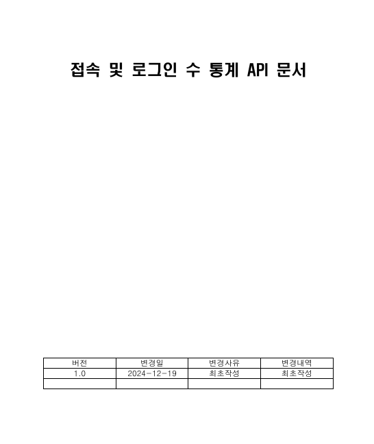
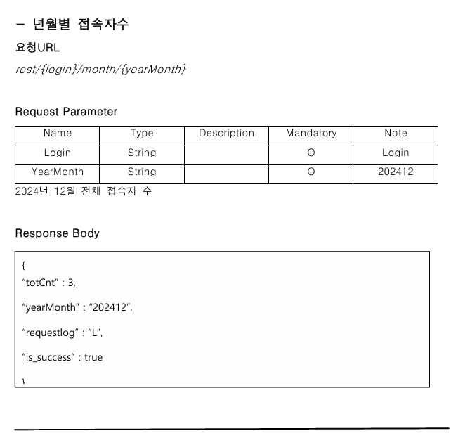
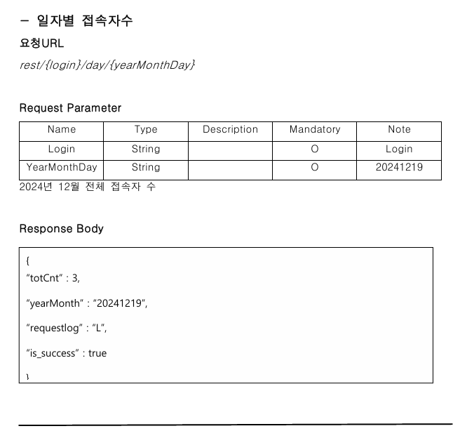
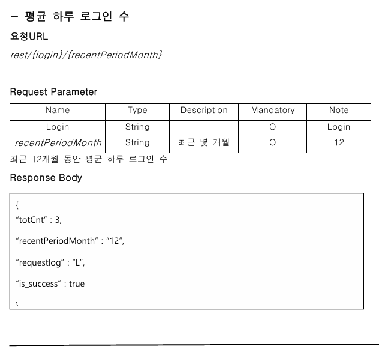
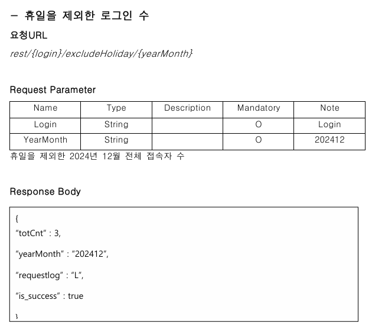
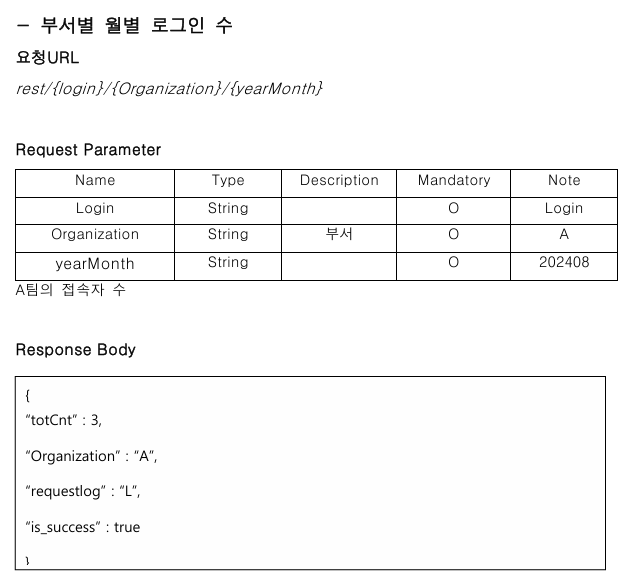
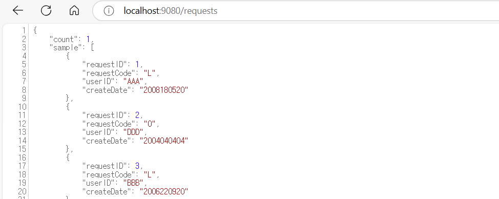

## 코멘토 springboot, mariaDB로 접속자 수, 로그인 수 통계 API 구축하기

### 2차 과제
1. API 문서 작성

### 1차 과제
1. spring 개발환경 셋팅

   ○ IntelliJ Community 버전 설치 ( 2024.01 )
        
        - JDK 11버전, maven, jetty(톰캣x)

   ○디비버 커뮤니티 버전 다운로드

        - mariaDB 커넥션 진행

